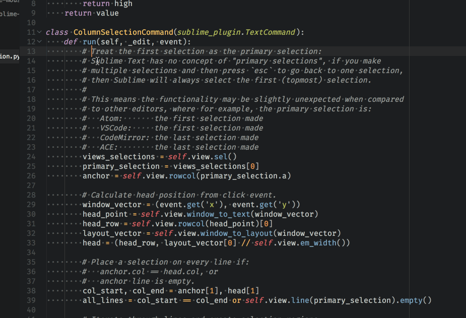

# VSCodeColumnSelection

Adds a column selection command to Sublime Text similar to VSCode's <kbd>shift</kbd> + <kbd>alt</kbd> + <kbd>click</kbd>.

## Installation

#### Automatic

Via Package Control. Search for `VSCodeColumnSelection`.

#### Manual

Clone this repository into your Sublime Text's Packages directory. Easy.

```sh
cd /path/to/Sublime Text/Packages
git clone https://github.com/acheronfail/VSCodeColumnSelection.git
```

## Usage

This package aims to add the VSCcode-like column selection commands to Sublime Text. While it aims to mimic as close as possible the behaviour of VSCode, there is a slight limitation (see [L13-23](https://github.com/acheronfail/VSCodeColumnSelection/blob/4f3c0b574603cd3e6b9138bef4e667915ab30545/vscode_column_selection.py#L13-L23)). Other than that, it works a treat!

Place a cursor anywhere, and then <kbd>shift</kbd> + <kbd>alt</kbd> + <kbd>click</kbd> where you want the bottom right of the column selection to end. Best explained with a gif:



### Remapping to different keys

This package adds the command `"column_selection"`. If you want to map it to a different mouse command, then you need to add that in your sublime-mousemap like so:

```js
{
    "button": "button1",
    // Remap command to shift+super
    "modifiers": ["shift", "super"],
    "press_command": "column_selection"
}
```

### Known Issues

* Doesn't work with wrapped lines
	- Unfortunately, due to a limitation with Sublime's API this isn't feasible to implement at the moment. See the [topic in forum.sublimetext](https://forum.sublimetext.com/t/how-to-find-wrapped-line-lengths/36045)

# License

[MIT](./LICENSE)
